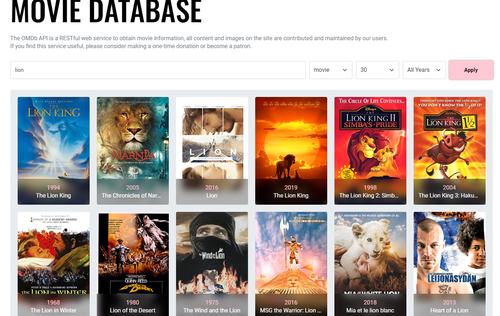
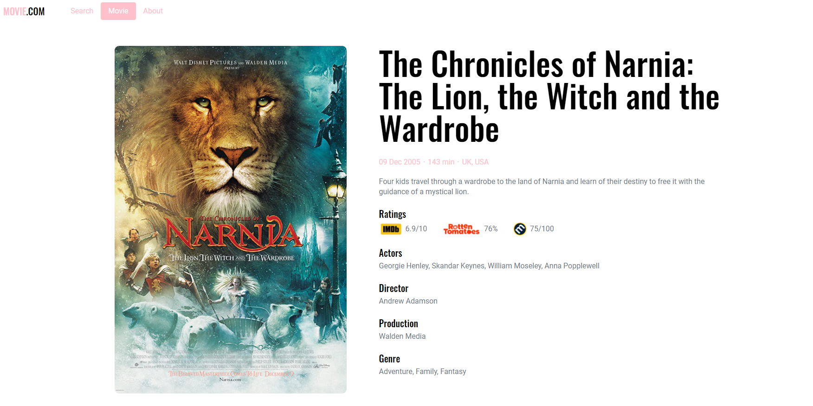
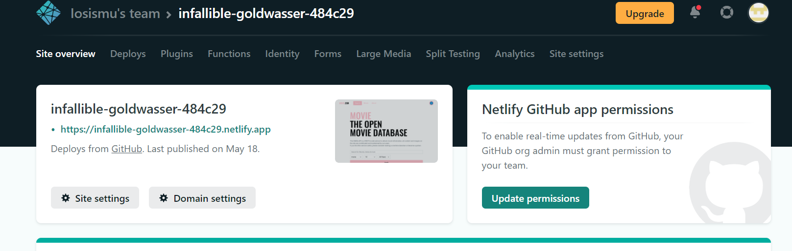

# 영화 정보 제공 사이트 Project with Vue3 and Webpack

## Versions

- [Notion Docs 바로가기](https://www.notion.so/b1d0e748cd7542e0a6a32d3338b523fa)<br>
- [사이트 바로가기](https://infallible-goldwasser-484c29.netlify.app/)<br>

## Nuxt Version

- [Notion Docs 바로가기](https://www.notion.so/Nuxt-js-8eadaab34d27452d88dbe556e4b8555c)<br>
- [Nuxt.js Version 바로가기](https://rose-nuxt-movie-app.herokuapp.com/)<br>

<!-- ## Installation

```bash
# Default.
$ npx degit ParkYoungWoong/vue3-webpack-template DIRECTORY_NAME

# With ESLint, Add `#eslint`.
$ npx degit ParkYoungWoong/vue3-webpack-template#eslint DIRECTORY_NAME

# With ESLint + Vuex, Add `#vuex`.
$ npx degit ParkYoungWoong/vue3-webpack-template#vuex DIRECTORY_NAME

# With ESLint + Vuex + VueRouter, Add `#vue-router`.
$ npx degit ParkYoungWoong/vue3-webpack-template#vue-router DIRECTORY_NAME

# Start!
$ cd DIRECTORY_NAME
$ npm i
$ npm run dev
``` -->

## Specs

- Vue3
- Webpack
- SCSS
- Babel
- PostCSS
- Autoprefixer
- ESLint **(+ESLint)**
- Vuex **(+Vuex)**
- Vue Router **(+VueRouter)**
- Axios

## API

- OMDB API

<!-- ## 주의사항!

- `npm i vue@next`로 설치(3버전)
- `npm i vue-loader@next`로 설치(3버전)
- `npm i -D webpack-dev-server@next`로 설치(webpack-cli 버전(@4^)과 일치)!<br>
- `package.json` 옵션으로 `browserslist` 추가!<br>
- `.postcssrc.js` 생성(PostCSS 구성 옵션)!<br>
- `.babelrc.js` 생성(Babel 구성 옵션)!<br>
- `.eslintrc.js` 생성(ESLint 구성 옵션)! **(+ESLint)**<br>

## ESLint Auto fix on save for VSCode

- 모든 명령 표시(Windows: `Ctrl`+`Shift`+`P` / macOS: `Cmd`+`Shift`+`P`)
- 모든 명령 표시에서 `settings` 검색
- `Preferences: Open Settings (JSON)` 선택
- 오픈된 `settings.json`파일에서 아래 코드 추가 및 저장

```json
{
  "editor.codeActionsOnSave": {
    "source.fixAll.eslint": true
  }
}
``` -->

# <기능 설명>

### 1. 영화 정보 검색 기능

<p align='center'>
  
</p>

- Nelify에서 Severless 함수를 만들어서 API키가 노출 되지 않도록 기능 구현 했습니다.

```javascript
const axios = require('axios')
const { OMDB_API_KEY } = process.env

exports.handler = async function (event) {
  console.log(event)
  const payload = JSON.parse(event.body) // 네트워크로 데이터가 이동할때는 여러가지 문제때문에 문자데이터로 전송하게 되는데 밑에 객체구조분해를 해야되나까 다시 parse해서 객체데이터로 변환해서 사용
  const { title, type, year, page, id } = payload
  const url = id // 삼항 연산자로 id값이 있을 경우 앞에 없을경우 뒤에꺼 넣는다
  ? `https://www.omdbapi.com/?apikey=${OMDB_API_KEY}&i=${id}` // 영화 개별로 요청
  : `https://www.omdbapi.com/?apikey=${OMDB_API_KEY}&s=${title}&type=${type}&y=${year}&page=${page}` // 전체 영화 검색 정보 요청

  try {
    const { data } = await axios.get(url)
    if (data.Error) {
      return {
        statusCode: 400,
        body: data.Error
      }
    }
    return {
      statusCode: 200,
      body: JSON.stringify(data)
    }
  } catch (error) {
    return {
      statusCode: error.response.status,
      body: error.message
    }
  }
```

- OMDB API와 Axios를 이용해서 양식에 맞게 API에 요청을 보냅니다.

```javascript
async function _fetchMovie(payload) {
  // fetchMovie가 복잡해 질 수록 반대로 재활용성이 올라간다.
  return await axios.post("/.netlify/functions/movie", payload); // Serverless 함수로 post로 요청
  // get은 쿼리스트링으로 요청을하게 되면 풀어서 하나하나 넣어야되서 되게 불편함 그래서 post
}
```

### 2. 영화 상세 페이지

<p align='center'>
 
</p>

- MovieList에서 Props로 받은 movie data를 가지고 Vue에서 제공하는 RouterLink를 이용해서 영화 상세 페이지로 이동 합니다.
- RouterLink 넘어왔으니 url로 '/movie/:id' :id값을 가져온 후, 해당 id값으로 OMBD API에 해당 id의 영화 정보를 가져와서 화면에 뿌려줍니다.

# <배포>

### Netlify에서 Vue.js 앱 배포

<p align='center'>
 
</p>

## Packages

**webpack**: 모듈(패키지) 번들러의 핵심 패키지<br>
**webpack-cli**: 터미널에서 Webpack 명령(CLI)을 사용할 수 있음<br>
**webpack-dev-server**: 개발용으로 Live Server를 실행(HMR)<br>

**html-webpack-plugin**: 최초 실행될 HTML 파일(템플릿)을 연결<br>
**copy-webpack-plugin**: 정적 파일(파비콘, 이미지 등)을 제품(`dist`) 폴더로 복사<br>

**sass-loader**: SCSS(Sass) 파일을 로드<br>
**postcss-loader**: PostCSS(Autoprefixer)로 스타일 파일을 처리<br>
**css-loader**: CSS 파일을 로드<br>
**style-loader**: 로드된 스타일(CSS)을 `<style>`로 `<head>`에 삽입<br>
**babel-loader**: JS 파일을 로드<br>
**vue-loader**: Vue 파일을 로드<br>
**vue-style-loader**: Vue 파일의 로드된 스타일(CSS)을 `<style>`로 `<head>`에 삽입<br>
**file-loader**: 지정된 파일(이미지)을 로드<br>

**@babel/core**: ES6 이상의 코드를 ES5 이하 버전으로 변환<br>
**@babel/preset-env**: Babel 지원 스펙을 지정<br>
**@babel/plugin-transform-runtime**: Async/Await 문법 지원<br>

**sass**: SCSS(Sass) 문법을 해석(스타일 전처리기)<br>
**postcss**: Autoprefixer 등의 다양한 스타일 후처리기 패키지<br>
**autoprefixer**: 스타일에 자동으로 공급 업체 접두사(Vendor prefix)를 적용하는 PostCSS의 플러그인<br>

**vue**: Vue.js 프레임워크<br>
**@vue/compiler-sfc**: .vue 파일(SFC, 3버전)을 해석<br>

**eslint**: 정적 코드 분석 도구 **(+ESLint)**<br>
**eslint-plugin-vue**: Vue.js 코드 분석 **(+ESLint)**<br>
**babel-eslint**: ES6 이상의 코드(Babel)를 분석 **(+ESLint)**<br>

**vuex**: 중앙 집중식 저장소 **(+Vuex)**<br>
**vue-router**: 라우터 **(+VueRouter)**<br>
